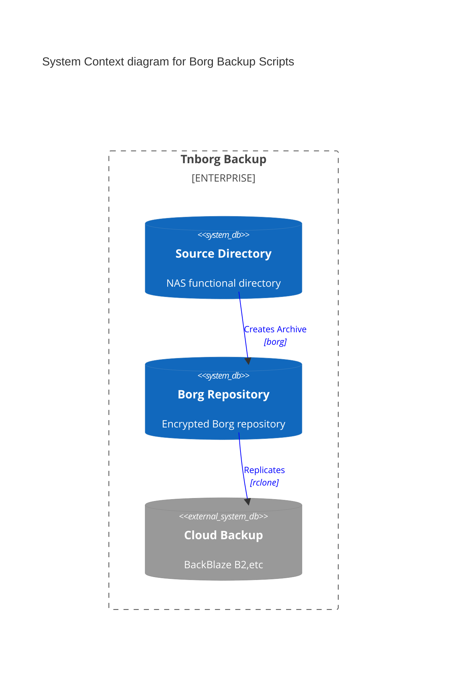

# tnborg
## Description
Personal scripts for adding borg backup to TrueNAS

These scripts allow a number of areas on the TrueNAS system to be backed
up locally to encrypted Borg repositories in a staging area. These Borg
repositories can contain a number of archives, allowing historical data
access. The encrypted Borg repositories are replicated on a cloud
backup platform for disaster recovery.

Splitting the NAS data into separate repositories in this way allows for
selective cloud backup, and also for staged recovery.

A list of scripts can be found in [SCRIPTS.md](SCRIPTS.md)

## Obtaining a borg executable
You'll need a borg executable to use with these scripts. See the file
[BORG.md](BORG.md) for instructions on this.

## Installation
1. Create a new user to store the scripts used by borg. The user is
   unprivileged and does not need to be accessible from over the network,
   except when the scripts are being copied or updated. We'll assume the user
   is called `tnborg` here.
2. Make `tnborg` temporarily accessible over the network.
3. Copy the scripts and config directories from this repository to `~tnborg`.
4. Copy a suitable borg executable to `~tnborg` (see [BORG.md](BORG.md)).
5. Copy `misc/borg.sh` to `~tnborg/bin` and exit it appropriately.
6. Edit the config files for your installation.
7. Test the scripts by hand.
8. Create a TrueNAS cronjob to run the `daily.py` script on an appropriate
   schedule.

# Documentation quality
The documentation here is not currently comprehensive, as it is intended
for personal use. This may improve over time.
